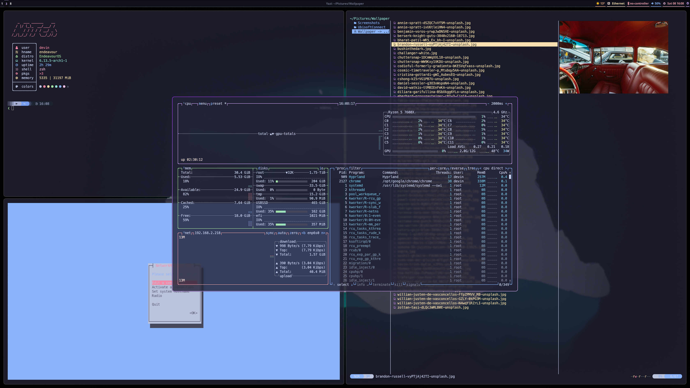

# My Hyprland :trollface:

This is my personal hyrpland configuration. It is heavily inspired by [typecraft](https://www.youtube.com/@typecraft_dev). <br><br>
Go to [keybindings](#keybinds)<br>
Go to [installation](#installation)<br><br>
If you want to change something with the desktop just edit this file `~/.config/hypr/hyprland.conf` <br> 

### Hyprland configuration

[Here](https://wiki.hyprland.org/Configuring/) you can find everything regarding hyprland.<br>
For multiple monitor settings refer to [this](https://wiki.hyprland.org/Configuring/Monitors/) site

### Configuration

If you want to configure this setup and change some stuff, you can find the most in the `~/.config` folder under the specific
element. For example you want to change the waybar configuration. You would then 
go to the `~/.config/waybar/config.jsonc` file and change according to their wiki the modules you want. This way everything is 
relatively easy to configure. But if something is not clear feel free to open an issue and i'll do my best to resolve it or
write a walkthrough on how to do it yourself.

> [!TIP]
> You can google what you need :wink:

## Prerequisite

> [!CAUTION]
> This configuration is aimed towards __arch users btw__ :neckbeard: with a minimal installation.

## Screenshots





## Installation

> [!IMPORTANT]
> Please read carefully when you are prompted. Usually pressing `y` is a good choice.

> [!NOTE]
> If not sure on an option just press Enter. The defaults often are good.

```bash
git clone https://github.com/HanmaDevin/hyprland.git ~/
```

```bash
cd hyprland
```

```bash
. ./scripts/install
```

You should be good to go afterwards. :shipit:

## Keybinds

Keybind | Action
--- | --- 
<kbd>Super</kbd> + <kbd>Return</kbd> | Open Terminal
<kbd>Super</kbd> + <kbd>Q</kbd> | Kill active Window
<kbd>Super</kbd> + <kbd>Backspace</kbd> | Open Logout-Menu
<kbd>Super</kbd> + <kbd>E</kbd> | Open yazi (File Manager)
<kbd>Super</kbd> + <kbd>V</kbd> | Toggle floating Window
<kbd>Super</kbd> + <kbd>Space</kbd> | Open Application Launcher
<kbd>Super</kbd> + <kbd>R</kbd> | Rotate Windows
<kbd>Super</kbd> + <kbd>F</kbd> | Toggle Fullscreen
<kbd>Super</kbd> + <kbd>H</kbd> | Move focus Left
<kbd>Super</kbd> + <kbd>J</kbd> | Move focus Down
<kbd>Super</kbd> + <kbd>K</kbd> | Move focus Up
<kbd>Super</kbd> + <kbd>L</kbd> | Move focus Right
<kbd>Super</kbd> + <kbd>Alt</kbd> + <kbd>H</kbd>| Resize Window Left
<kbd>Super</kbd> + <kbd>Alt</kbd> + <kbd>J</kbd>| Resize Window Down
<kbd>Super</kbd> + <kbd>Alt</kbd> + <kbd>K</kbd>| Resize Window Up
<kbd>Super</kbd> + <kbd>Alt</kbd> + <kbd>L</kbd>| Resize Window Right
<kbd>Super</kbd> + <kbd>Shift</kbd> + <kbd>H</kbd>| Move Window Left
<kbd>Super</kbd> + <kbd>Shift</kbd> + <kbd>J</kbd>| Move Window Down
<kbd>Super</kbd> + <kbd>Shift</kbd> + <kbd>K</kbd>| Move Window Up
<kbd>Super</kbd> + <kbd>Shift</kbd> + <kbd>L</kbd>| Move Window Right
<kbd>Super</kbd> + <kbd>B</kbd> | Open Chrome
<kbd>Super</kbd> + <kbd>S</kbd> | Open Steam
<kbd>Super</kbd> + <kbd>M</kbd> | Open btop (System Monitor)
<kbd>Super</kbd> + <kbd>Shift</kbd> + <kbd>V</kbd>| Launch Sound Settings
<kbd>Super</kbd> + <kbd>Shift</kbd> + <kbd>S</kbd>| Take Screenshot of a region to clipboard
<kbd>Super</kbd> + <kbd>Control</kbd> + <kbd>S</kbd>| Take Screenshot of a region (~/Pictures/Screenshots/)
<kbd>Super</kbd> + <kbd>[0-9]</kbd> | Switch to Workspace [0-9]
<kbd>Super</kbd> + <kbd>Shift</kbd> + <kbd>[0-9]</kbd> | Move Window to Workspace [0-9]
<kbd>Super</kbd> + <kbd>Right Click</kbd> | Resize Window with the Mouse
<kbd>Super</kbd> + <kbd>Left Click</kbd> | Move Window with the Mouse
