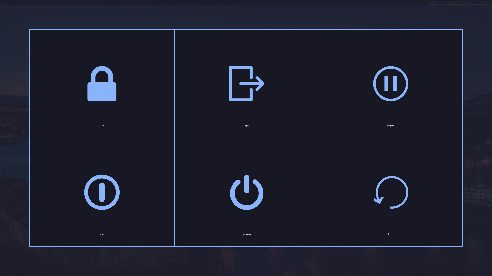
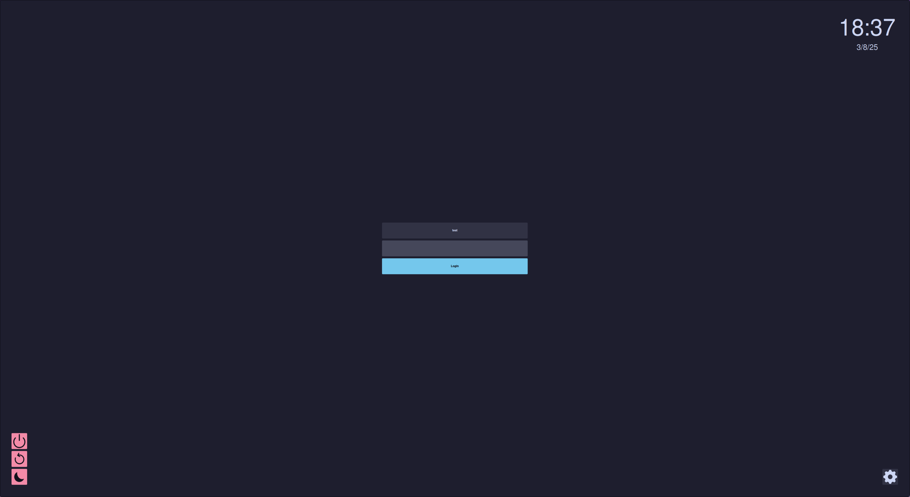
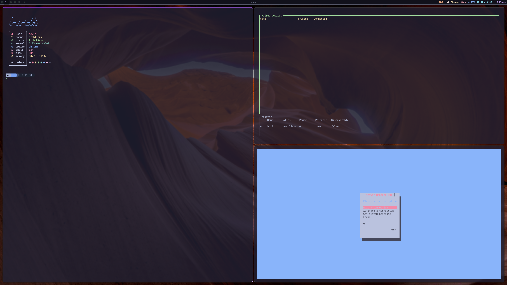
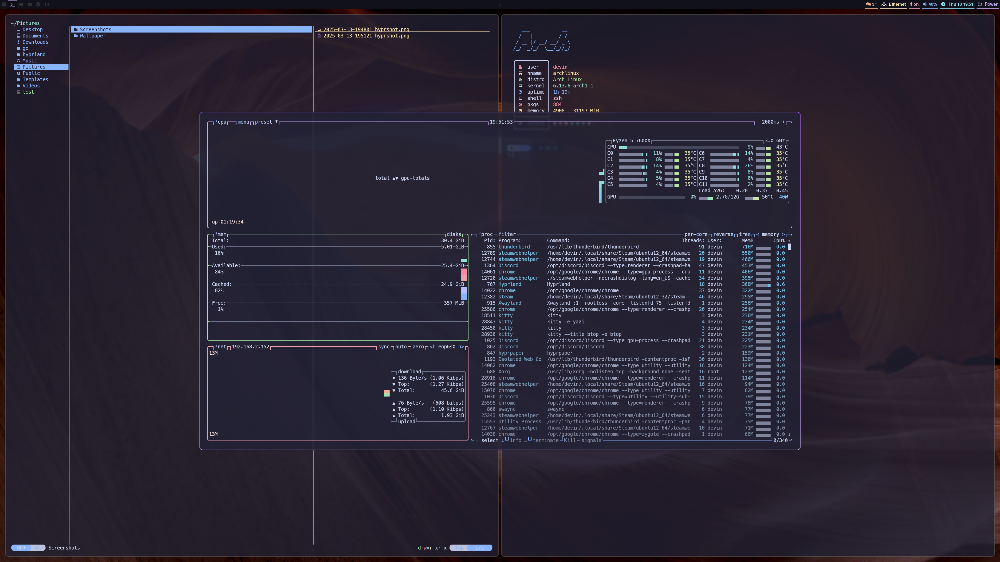

# My Hyprland


This is my personal hyrpland configuration. It is heavily inspired by [typecraft](https://www.youtube.com/@typecraft_dev). <br><br>
Go to [keybindings](#keybinds)<br>
Go to [installation](#installation)<br><br>
If you want to change something with the desktop just edit this file `~/.config/hypr/hyprland.conf` <br> 

## Configuration

If you want to configure this setup and change some stuff, you can find the most in the `~/.config` folder under the specific
element. For example you want to change the waybar configuration. You would then 
go to the `~/.config/waybar/config.jsonc` file and change according to their wiki the modules you want. This way everything is 
relatively easy to configure. But if something is not clear feel free to open an issue and i'll do my best to resolve it or
write a walkthrough on how to do it yourself.

### Disclaimer

I love vim and the philosophy about only using the keyboard hence why most of the programs I setup use vimkeys.
If you don't like that (which I think you do :upside_down_face:) then you might need to reconfigure a lot.

> [!NOTE]
> If you want you can make common sites in chrome like youtube and drive also have the catppuccin theme.
> [Chrome Catppuccin](#catppuccin-chrome)

### Hyprland configuration

[Here](https://wiki.hyprland.org/Configuring/) you can find everything regarding hyprland.<br>
For multiple monitor configuration refer to [this](https://wiki.hyprland.org/Configuring/Monitors/)

> [!TIP]
> You can google what you need :wink:

## Prerequisite

> [!CAUTION]
> This configuration is aimed towards __arch users btw__ :neckbeard: with a minimal installation.

## Screenshots







## Installation

> [!IMPORTANT]
> Please read carefully when you are prompted. Usually pressing `y` is a good choice.

> [!NOTE]
> If not sure on an option just press Enter. The defaults often are good.
<br>
Copy these commands to your terminal and run them one by one 😃 <br><br>

```bash
git clone https://github.com/HanmaDevin/hyprland.git ~/
```

```bash
cd hyprland
```

> [!IMPORTANT]
> Make sure you clone into the `$HOME`-folder. The script depends on it.

> [!CAUTION]
> Please make sure to select *Grub* & *NetworkManager* during arch-installation for a more complete setup :grin:
> Don't forget to use *pulseadudio* during the installation.

```bash
./scripts/install
```

### Nvidia

The install script scans for nvidia hardware and installs the driver for you,
assuming you are using the arch-linux kernel :kiss:

<br>
You should be good to go afterwards. :shipit:

## Keybinds

Keybind | Action
--- | --- 
<kbd>Super</kbd> + <kbd>Return</kbd> | Open Terminal
<kbd>Super</kbd> + <kbd>Q</kbd> | Kill active Window
<kbd>Super</kbd> + <kbd>Backspace</kbd> | Open Logout-Menu
<kbd>Super</kbd> + <kbd>E</kbd> | Open yazi (File Manager)
<kbd>Super</kbd> + <kbd>V</kbd> | Toggle floating Window
<kbd>Super</kbd> + <kbd>W</kbd> | Reload Waybar (Status Bar)
<kbd>Super</kbd> + <kbd>P</kbd> | Change Wallpaper randomly
<kbd>Super</kbd> + <kbd>Space</kbd> | Open Application Launcher
<kbd>Super</kbd> + <kbd>R</kbd> | Rotate Windows
<kbd>Super</kbd> + <kbd>F</kbd> | Toggle Fullscreen
<kbd>Super</kbd> + <kbd>H</kbd> | Move focus Left
<kbd>Super</kbd> + <kbd>J</kbd> | Move focus Down
<kbd>Super</kbd> + <kbd>K</kbd> | Move focus Up
<kbd>Super</kbd> + <kbd>L</kbd> | Move focus Right
<kbd>Super</kbd> + <kbd>Alt</kbd> + <kbd>H</kbd>| Resize Window Left
<kbd>Super</kbd> + <kbd>Alt</kbd> + <kbd>J</kbd>| Resize Window Down
<kbd>Super</kbd> + <kbd>Alt</kbd> + <kbd>K</kbd>| Resize Window Up
<kbd>Super</kbd> + <kbd>Alt</kbd> + <kbd>L</kbd>| Resize Window Right
<kbd>Super</kbd> + <kbd>Shift</kbd> + <kbd>H</kbd>| Move Window Left
<kbd>Super</kbd> + <kbd>Shift</kbd> + <kbd>J</kbd>| Move Window Down
<kbd>Super</kbd> + <kbd>Shift</kbd> + <kbd>K</kbd>| Move Window Up
<kbd>Super</kbd> + <kbd>Shift</kbd> + <kbd>L</kbd>| Move Window Right
<kbd>Super</kbd> + <kbd>B</kbd> | Open Chrome
<kbd>Super</kbd> + <kbd>S</kbd> | Open Steam
<kbd>Super</kbd> + <kbd>M</kbd> | Open btop (System Monitor)
<kbd>Super</kbd> + <kbd>Shift</kbd> + <kbd>V</kbd>| Launch Sound Settings
<kbd>Super</kbd> + <kbd>Shift</kbd> + <kbd>S</kbd>| Take Screenshot of a region to clipboard
<kbd>Super</kbd> + <kbd>Control</kbd> + <kbd>S</kbd>| Take Screenshot of a region (~/Pictures/Screenshots/)
<kbd>Super</kbd> + <kbd>[0-9]</kbd> | Switch to Workspace [0-9]
<kbd>Super</kbd> + <kbd>Shift</kbd> + <kbd>[0-9]</kbd> | Move Window to Workspace [0-9]
<kbd>Super</kbd> + <kbd>Right Click</kbd> | Resize Window with the Mouse
<kbd>Super</kbd> + <kbd>Left Click</kbd> | Move Window with the Mouse


## Catppuccin Chrome

1. You need to add the *Stylus*-extension for chrome. 
2. Then go to the *manage*-page of Stylus and click on *import*.
3. Lastly import the file under the `chrome-sites` directory.

### Catppuccin Thunderbird

1. Open Thunderbird, go to Settings > Add-ons and Themes
2. Click on the gear icon at the top-right corner and then select "Install Add-on From File..."
3. Select the file under the `thunderbird` directory.
